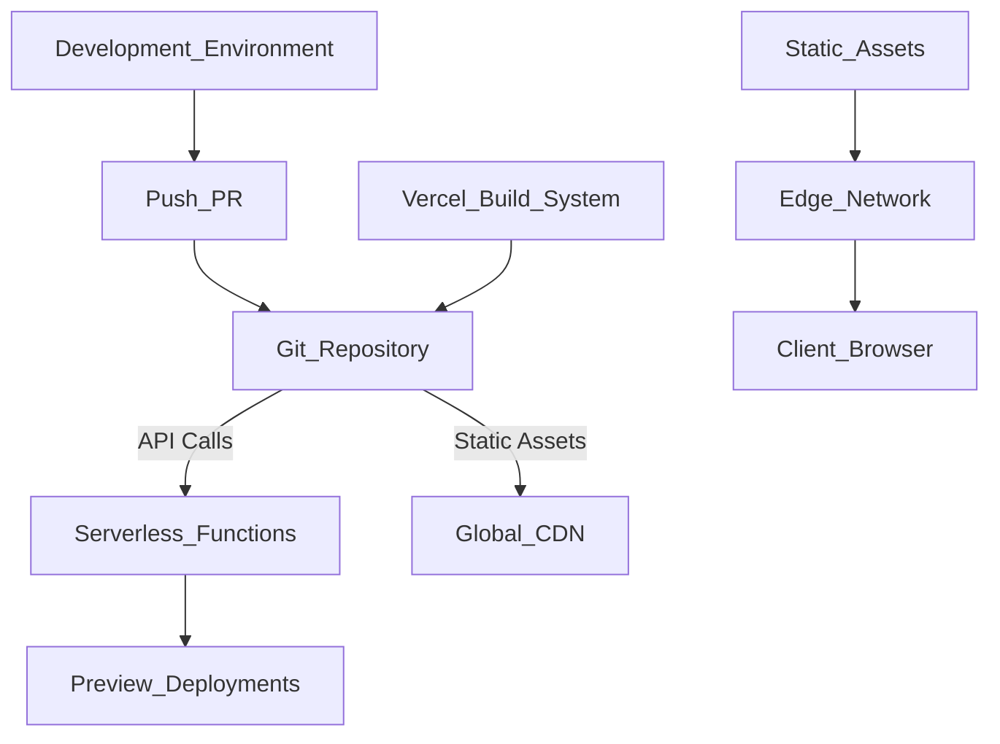
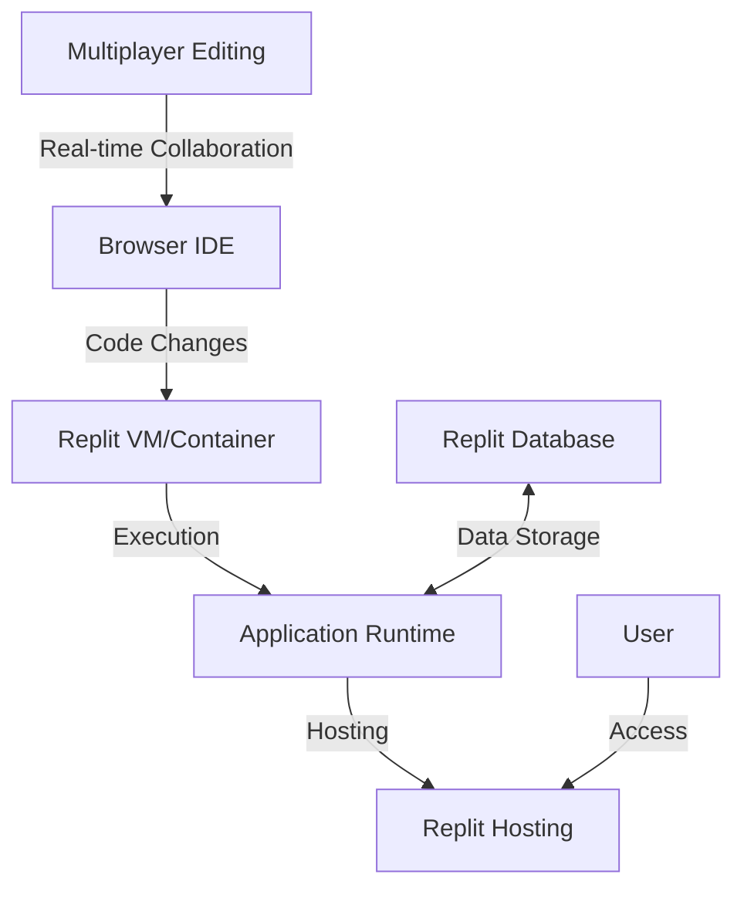
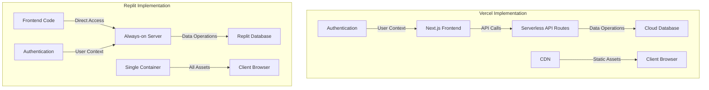
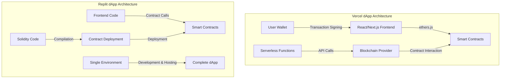
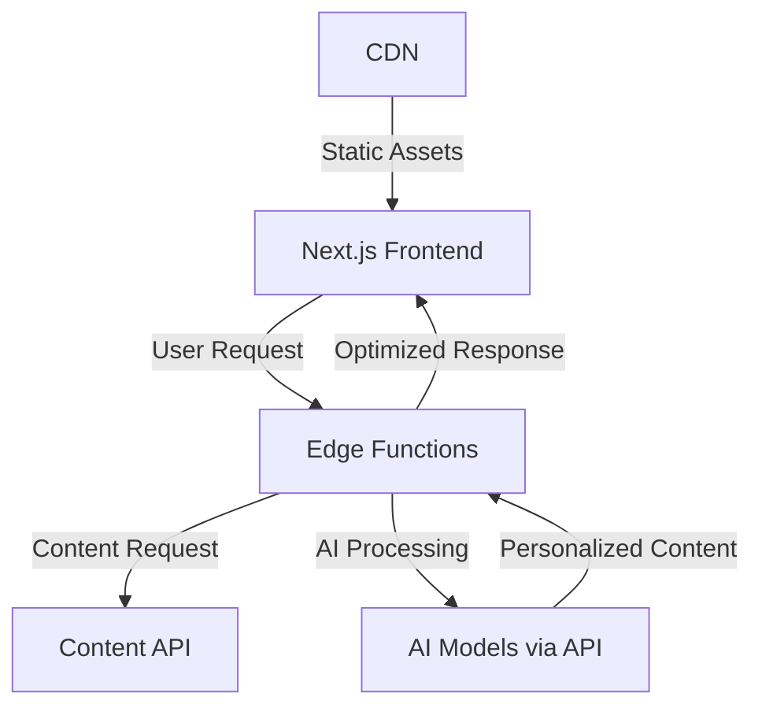
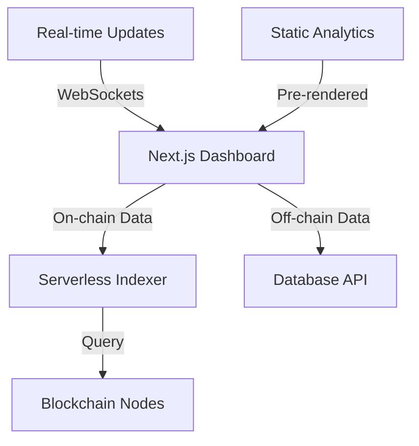
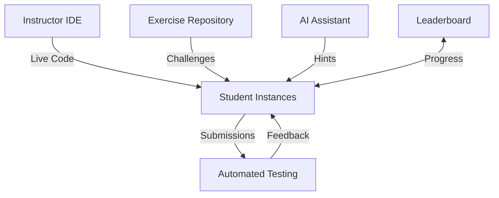
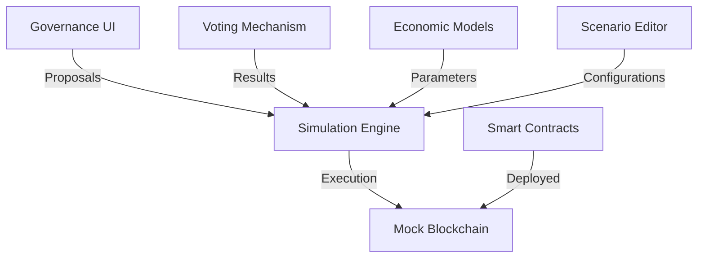

# Vercel vs Replit: Architecture Comparison

## Core Architecture Visualizations

### Vercel Architecture

Vercel's architecture centers on a serverless deployment model optimized for frontend frameworks. When code is pushed to a connected Git repository, the build system processes it, optimizing for frameworks like Next.js. Static assets deploy to a global CDN while dynamic functionality runs as serverless functions on the Edge Network. Every pull request generates an isolated preview deployment with its own URL.

### Replit Architecture

Replit provides a complete browser-based development environment. Each project runs in a persistent container with an integrated IDE supporting real-time collaboration. The same environment handles development and production, with applications immediately accessible via public URLs. Replit offers built-in database options and supports virtually any programming language or framework.

## Web2 vs Web3 Application Support

### Web2 Implementation Comparison

**Vercel Web2 Strengths:**

- Optimized for JAMstack and static site generation
- First-class Next.js support with automatic optimizations
- Seamless database integrations via marketplace
- Global CDN and edge functions for performance
- Git-based CI/CD with preview deployments

**Replit Web2 Strengths:**

- All-in-one development environment
- Support for any language/framework
- Built-in database options
- Always-on server model (not limited to serverless)
- Real-time collaboration

### Web3 Implementation Comparison

**Vercel Web3 Strengths:**

- Excellent for hosting dApp frontends
- Global distribution for low-latency access
- Serverless functions for blockchain interactions
- Strong performance optimizations

**Replit Web3 Strengths:**

- Native Solidity development support
- Integrated smart contract compilation and deployment
- Templates for blockchain projects
- All-in-one environment for contract and frontend development

## Innovative Example Use Cases

### Innovative Vercel Examples

**1. AI-Powered Content Platform with Edge Processing**

This platform uses Vercel's edge functions to process user requests and personalize content using AI models. The edge functions determine which content to serve based on user behavior, preferences, and context, then apply AI transformations before sending the response. This architecture minimizes latency while delivering highly personalized experiences.

**2. Hybrid Web3 Analytics Dashboard**

This dashboard combines on-chain and off-chain data to provide comprehensive analytics for Web3 applications. Vercel's serverless functions index blockchain data and combine it with traditional analytics. The dashboard uses incremental static regeneration for common views while providing real-time updates for critical metrics.

### Innovative Replit Examples

**1. Collaborative Code Education Platform**

This platform leverages Replit's collaborative features to create an interactive coding education experience. Instructors can demonstrate concepts in real-time while students follow along in their own instances. The system automatically tests student submissions, provides AI-powered hints, and tracks progress on a leaderboard.

**2. Decentralized Governance Simulator**

This simulator allows DAOs and other governance systems to test proposals in a safe environment before implementing them on-chain. Built entirely in Replit, it includes a mock blockchain, governance smart contracts, and economic models that predict outcomes. The always-on nature of Replit enables long-running simulations and collaborative scenario development.

## Key Architectural Differences

### Deployment Model

**Vercel:**

- Serverless-first approach with immutable deployments
- Git-based workflow with preview deployments
- Optimized for frontend frameworks
- Clear separation between development and production

**Replit:**

- Always-on container model
- Development and production in same environment
- Collaborative development focus
- Simplified deployment (run = deploy)

### Performance Considerations

**Vercel:**

- Global CDN for static assets
- Edge functions for low-latency operations
- Automatic image and asset optimization
- Framework-specific optimizations

**Replit:**

- Optimized for development experience
- Performance depends on plan tier
- No specialized CDN or edge network
- Requires manual performance optimizations

## Use Case Recommendations

### Choose Vercel For:

- Production-grade web applications requiring high performance
- Global content delivery with minimal latency
- Next.js and other modern frontend framework projects
- Teams with established Git workflows
- Projects requiring sophisticated CI/CD pipelines
- Web3 frontends that need global distribution

### Choose Replit For:

- Educational projects and learning environments
- Collaborative development with real-time feedback
- Rapid prototyping and experimentation
- Full-stack development in a single environment
- Smart contract development and testing
- Projects where deployment simplicity outweighs performance needs

## Conclusion

Vercel and Replit represent complementary approaches to modern web development. Vercel excels at optimized production deployments with its serverless architecture and global distribution network, making it ideal for customer-facing applications where performance is critical. Replit provides an integrated development environment with collaborative features and instant deployment, perfect for education, prototyping, and team collaboration.

Many developers leverage both platforms: using Replit for development and collaboration, then deploying production code to Vercel for optimal performance. The choice between them should be guided by your specific project requirements, team workflow, and priorities.
